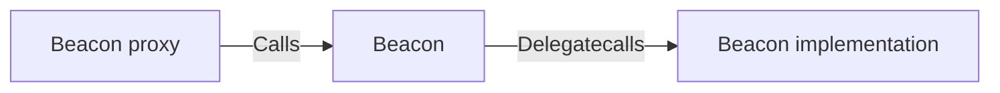
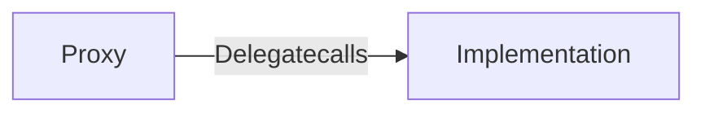
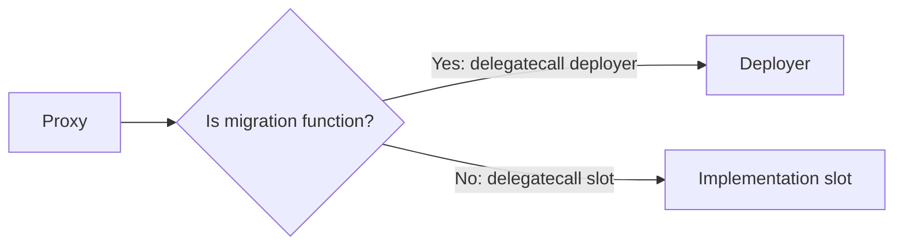

# bobcat-proxy

## Notes on use

Be sure to enforce access control on upgrade and migration functions properly! Be careful
not to accidentally burn your access here!

## The proxies

bobcat-proxy contains several proxies that fulfill different functions. These include:

1. beacon-proxy-no-slot.huff: Creates a "beacon proxy" that asks a hardcoded beacon for
its implementation address. In bobcat-sdk, it can be used with a custom function
signature, making a multiple contract implementation possible. This is useful for a normal
contract deployment situation with many addressess.

2. beacon-proxy.huff: Creates a "beacon proxy" that asks a beacon address at the beacon
storage slot for an implementation location. Useful for upgradeable beacons.

3. eip1967.huff: A very small proxy that literally just forwards calldata all the time to
the location provided in the implementation storage slot. This is useful for deployments
that won't see multiple copies of the same contract.

4. multi3-proxy.huff: A weird proxy that does delegatecall to an implementation chosen
based on the calldata given to its invocation. This is useful for a contract split across
multiple implementations that does not need upgrade features.

5. sel-beacon-proxy.huff: A proxy that asks a beacon for its implementation address based
on the selector given. This is useful for upgradeability when a contract needs to be split
across multiple contract locations.

6. metamorphic-on-fn.huff: A proxy that performs a metamorphic upgrade to a hardcoded
address when a specific selector is invoked. This is useful for optional super infrequent
upgrade migrations, perhaps in a limited account abstraction context. This might be useful
for situations where contract change includes a strictly additive method of feature
release. An approach might be to have a transparent upgradeable proxy in front of the
factory that deployed this, and having that as the hardcoded upgrade slot, but then having
the factory's implementation itself set as the slot that this calls. This should massively
reduce the amount of deployments on-chain of the contracts.

